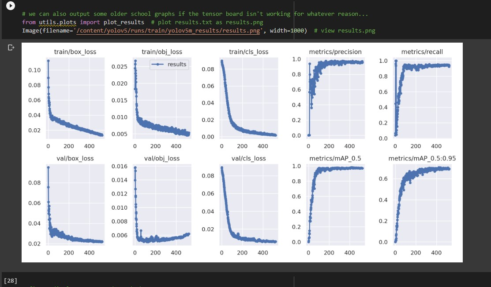
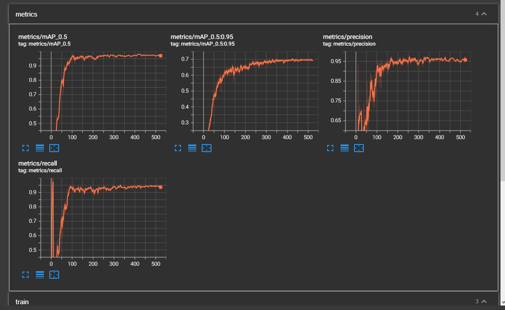
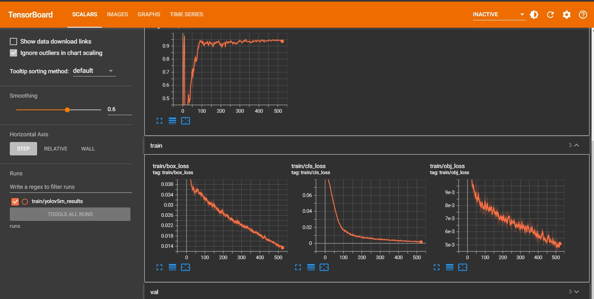
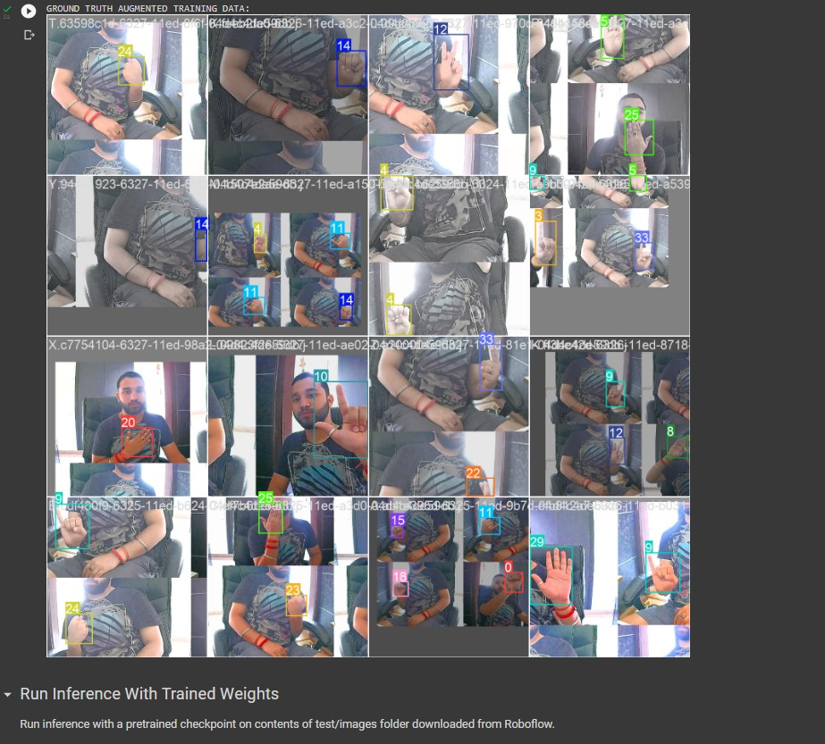

# sign_language_detection_YOLOV5

# How To Run:
### On GoogleCollab
```bash

1) Open the 'Sign_Language_detection_yolov5.ipynb' on Google Collab
2) Just run every shell

```

### On local system
```bash
git clone https://github.com/ultralytics/yolov5.git
```
```bash
extract 'yolov5.zip' and replace the orignal cloned 'yolov5' content
```
```bash
### For Prediction:
python detect.py --weights ./yolov5/runs/train/yolov5m_results/weights/best.pt --img 416 --conf 0.5 --source ./Data/test/images
```
```bash
### For Training:
python train.py --img 416 --batch 16 --epochs 580 --data './Data/data.yaml' --cfg ./yolov5/models/custom_yolov5m.yaml --weights 'yolov5m.pt'  --name yolov5m_results  --cache
```

# Evaluation Metrices:
 <table>
  <tr>
    <td>Result Graph After Training:</td>
  </tr>
  <tr>
    <td></td>
  </tr>
 </table>

### Tensorflow log/ Metric Graph:
 <table>
  <tr>
    <td>Tensorflow log: Metric</td>
    <td>Tensorflow log: Train</td>
  </tr>
  <tr>
    <td></td>
    <td> </td>
  </tr>
 </table>

  # Train Data: Evaluation
 <table>
  <tr>
    <td>Train Data With Ground Truth</td>
  </tr>
  <tr>
    <td></td>
  </tr>
 </table>


  # Predicted Images:
  <table>
  <tr>
    <td>Alphabets</td>
    <td>Greetings</td>
  </tr>
  <tr>
    <td></td>
    <td></td>
  </tr>
 </table>

 
 <table>
  <tr>
    <td>A</td>
    <td>B</td>
    <td>C</td>
    <td>D</td>
  </tr>
  <tr>
    <td></td>
    <td></td>
    <td></td>
    <td></td>
  </tr>
 </table> 


 <table>
  <tr>
    <td>E</td>
    <td>F</td>
    <td>G</td>
    <td>H</td>
  </tr>
  <tr>
    <td></td>
    <td></td>
    <td></td>
    <td></td>
  </tr>
 </table> 

 <table>
  <tr>
    <td>I</td>
    <td>J</td>
    <td>K</td>
    <td>L</td>
  </tr>
  <tr>
    <td></td>
    <td></td>
    <td></td>
    <td></td>
  </tr>
 </table> 

 <table>
  <tr>
    <td>M</td>
    <td>N</td>
    <td>O</td>
    <td>P</td>
  </tr>
  <tr>
    <td></td>
    <td></td>
    <td></td>
    <td></td>
  </tr>
 </table> 

 <table>
  <tr>
    <td>Q</td>
    <td>R</td>
    <td>S</td>
    <td>T</td>
  </tr>
  <tr>
    <td></td>
    <td></td>
    <td></td>
    <td></td>
  </tr>
 </table> 

 <table>
  <tr>
    <td>U</td>
    <td>V</td>
    <td>W</td>
    <td>X</td>
  </tr>
  <tr>
    <td></td>
    <td></td>
    <td></td>
    <td></td>
  </tr>
 </table> 

 <table>
  <tr>
    <td>Y</td>
    <td>Z</td>
    <td>Thanks</td>
    <td>Please</td>
  </tr>
  <tr>
    <td></td>
    <td></td>
    <td></td>
    <td></td>
  </tr>
 </table> 

 <table>
  <tr>
    <td>Hello</td>
    <td>IloveYou</td>
    <td>What</td>
    <td>Name</td>
  </tr>
  <tr>
    <td></td>
    <td></td>
    <td></td>
    <td></td>
  </tr>
 </table> 


 <table>
  <tr>
    <td>Yes</td>
    <td>No</td>
    <!-- <td>Thanks</td>
    <td>Please</td> -->
  </tr>
  <tr>
    <td></td>
    <td></td>
    <!-- <td></td>
    <td></td> -->
  </tr>
 </table> 

```bash
Author : Rishabh
Contact: rbrishabh76@gmail.com
```
